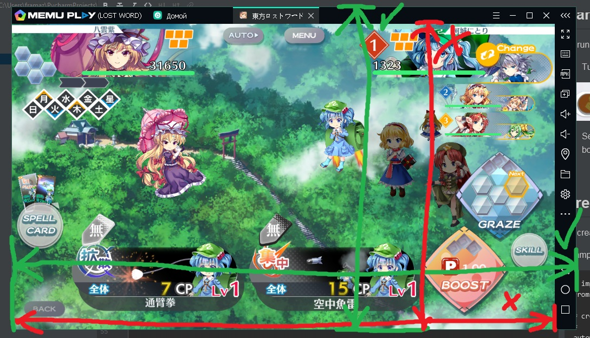
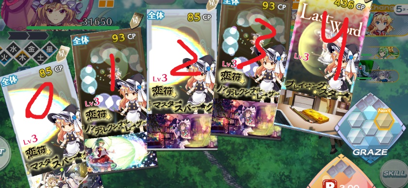

# 2huLW Automation
A simple python app for generating automation scripts for Touhou Lost Word.

You don't even need python knowledge to use it.

## Is it bannable?
Most likely yes.

Automation is against the LW's rules. Usage of scripts may lead to your ban. 
I'm not responsible if you get banned for using this or any other app.

On the other hand, i was using it from the start for 8-10 hours a day with breaks and still not banned.

## Ban avoidance
This automation app clicks in a randomized radius around the centers of buttons,
the time between actions is randomized too, so it's harder to detect that 
you automated anythinf.

If you keep the script running at inhuman pace(ex. 22 hours every day or 40 hours
marathons without any breaks) it's really easy to detect your cheating. You should 
take breaks and don't run it for too much.

## Installation
* Download autohotkey.
* Download python, version >= 3.5.
* Download and unpack 2huLW Automation.

No additional python packages are needed.

## Emulator configuration 
The app was tested only with MEmu emulator.
1. Set the emulator device's screen resolution to 1280x720(others are not tested).
2. Change emulator device's name to "LOST WORD".
2.1. If the .ahk script doesn't work for you(it doesn't even click on emu screen),
then it means the script can't find the emu window because of wrong window title.
You can use Pulover's Macro Creator to find the window's title of your emu.

## Game configuration
To run this script you should do the following:
1. Turn on skill animation skipping(when in battle in menu)


2. Set the emu window at the size you want and measure it's width and height in 
pixels with borders. To run the script without problems, you have to always keep 
the window at the measured size.
Advice: you can open something on a half of the screen, and fit the emu window
to the other half of the screen.



## Creating a script
To create a script you should edit main.py file with any text redactor.

Example of a script(# means commentary, everything in a line after it will not be executed):
```
# importing the automator
from lwautomation import LWAutomation

# Emu window title, maybe this one even works for you
title = "Qt5QWindowIcon22, (LOST WORD) ahk_class Qt5QWindowIcon ahk_exe MEmu.exe"

# Measured width and heigth of the window you measured before.
width = 751
heigth = 434

# creating automation object
automator = LWAutomation(title, width, heigth)

# creating a script
# for example, we have only one character in the middle with a swap char
# let's do a level 5 times in a loop
# notice that only code wich starts with four spaces is looped
with automator.loop(5):
    # it's our turn
    automator.swap_char()  # swap out the char
    automator.power_up(1)  # use one power
    automator.graze(3)  # use three grazes
    automator.use_spellcard(4)  # use spellcard number 4(LW), notice that numeration starts with 0

    # after we did our, we have to wait till every animation is played
    # for it we call end_turn function
    # we pass two arguments to it: max_enemy_attacks and max_enemy_spells
    # you shoud try to predict it correctly to reduce the waiting time
    # if you can't predict it, you may hust call it without arguments like this:
    # automator.end_turn() - this implies the longes scenario: enemy will do 3 spells
    automator.end_turn(max_enemy_attacks=2, max_enemy_spells=1)

    # next turn
    # use skills
    # this uses first and third spells of the middle character
    automator.use_skills(3, 5)

    # use right attack
    automator.use_attack(1)

    # end turn, we expect all enemies to be dead, so noone attacks
    automator.end_turn(max_enemy_attacks=0, max_enemy_spells=0)

    # then we finish the stage and restart the battle
    automator.restart_after_battle()
# loop ends as there are no more spaces before code

# the following line will create a file "myscript.ahk" with resulting script
# in the app's directory
# call automator.create_script AFTER you wrote you all actions you needed
automator.create_script("myscript.ahk")
```
After you finished editing main.py, you can now run it with python:
1. Open cmd and navigate to where you unpacked 2huLW Automation.
2. Execute command ```python main.py```

Now the resulting script is saved in file "myscript.ahk" in the 2huLW Automation directory.
You can now run "myscript.ahk" and see how it works.

## Reference

### use_spellcard(spellcard_num) — uses a spellcard on current char



### use_attack(attack_num) — uses an attack on current char


### power_up(number_of_powerups) — use power up number_of_powerups times

### graze(number_of_grazes) — use graze number_of_grazes times

### use_skills(skill_num1, skill_num2...) — use character skills skill_num1, skill_num2...

Example: usage of left skills of left and middle characters:

```use_skills(0, 3)```


### swap_char() — swaps out current character

### end_turn(max_enemy_attacks, max_enemy_spells) — wait till the end of attacks

Always call it after your turn ended.

Expect enemy to attack max_enemy_attacks times and use spells max_enemy_spells times.

### with automator.loop(n) — loops following commands n times

Example:

```
with automator.loop(3):
    automator.use_attack(0)
automator.use_attack(1)
```

The code will use left attack 3 times, but right attack only once.

### create_script(script_path=path) — saves result to path(path has to be with "")

